

  

    Selected moments
    22 photographs
  

  <figure class="life-gallery-feature">
    
  </figure>

  

    <figure class="life-gallery-item">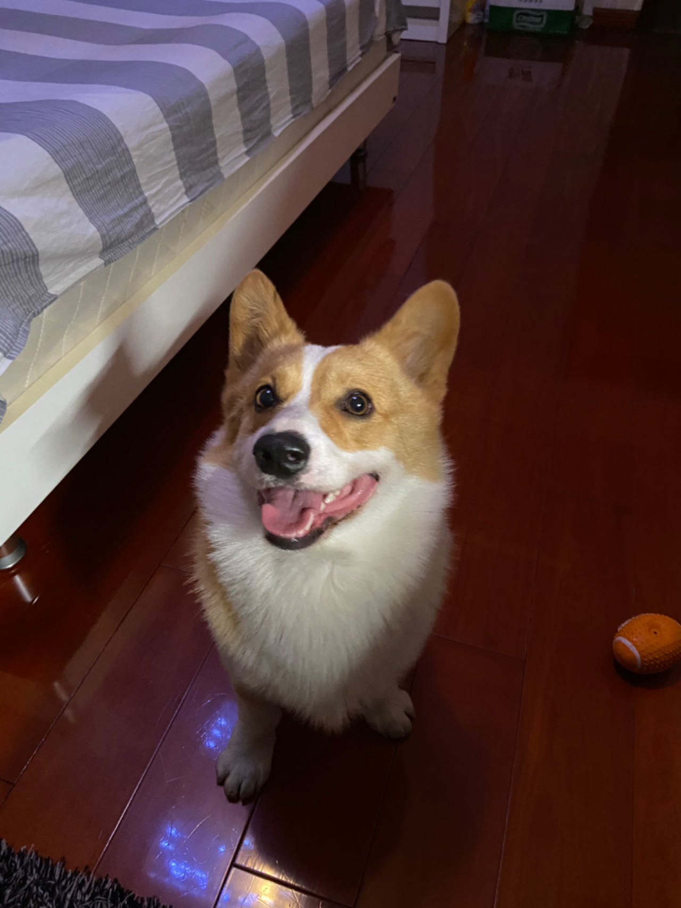</figure>
    <figure class="life-gallery-item">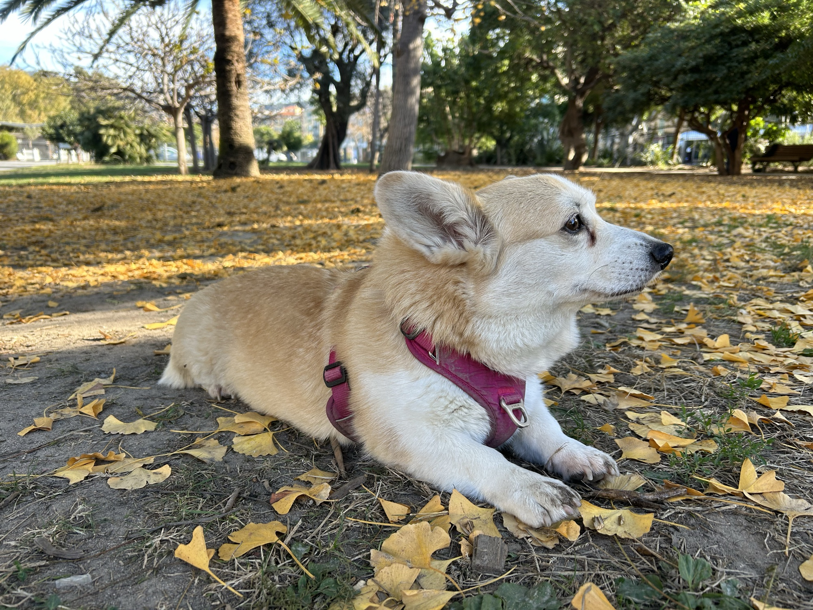</figure>
    <figure class="life-gallery-item"></figure>
    <figure class="life-gallery-item"></figure>
    <figure class="life-gallery-item">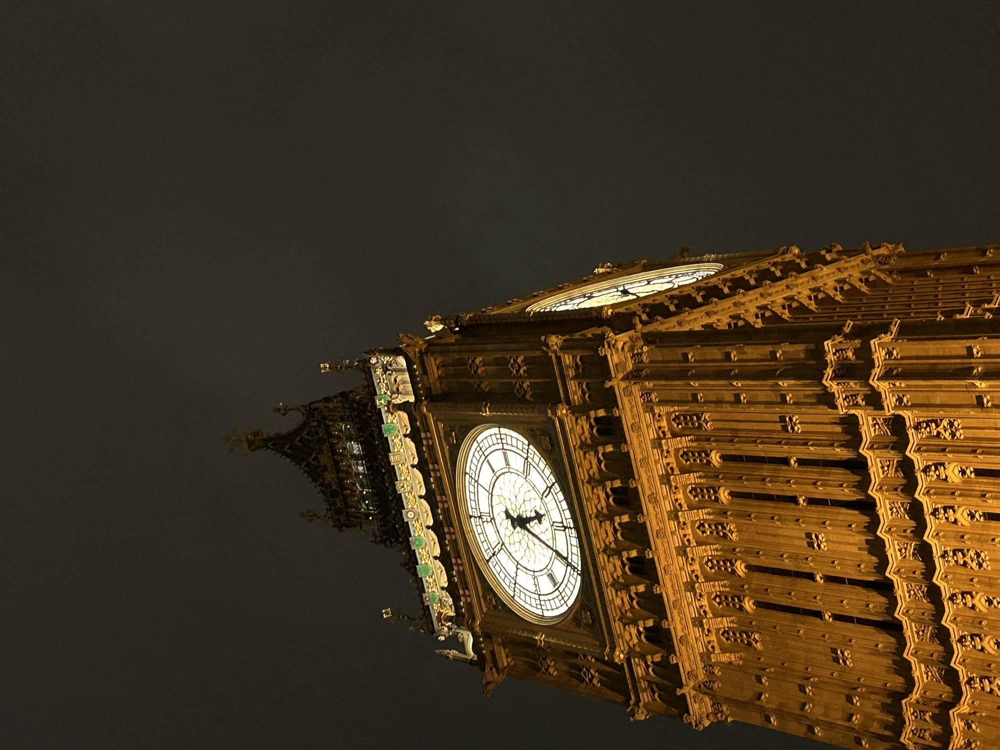</figure>
    <figure class="life-gallery-item">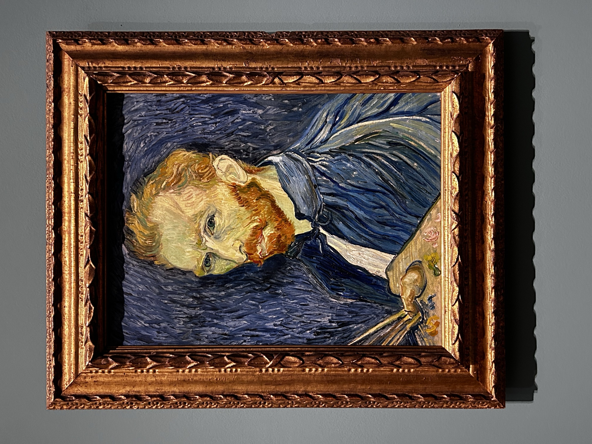</figure>
    <figure class="life-gallery-item">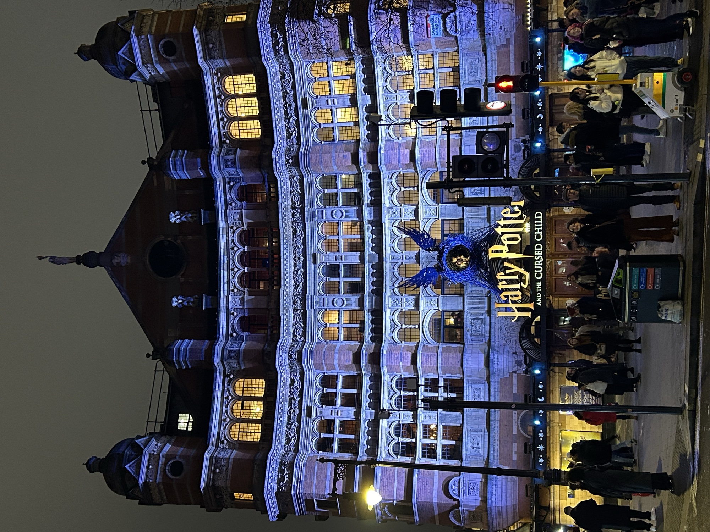</figure>
    <figure class="life-gallery-item">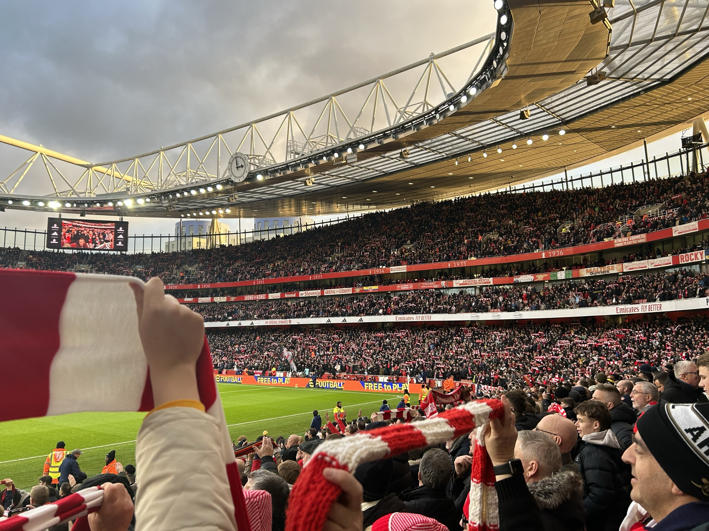</figure>
    <figure class="life-gallery-item"></figure>
    <figure class="life-gallery-item"></figure>
    <figure class="life-gallery-item"></figure>
    <figure class="life-gallery-item"></figure>
    <figure class="life-gallery-item">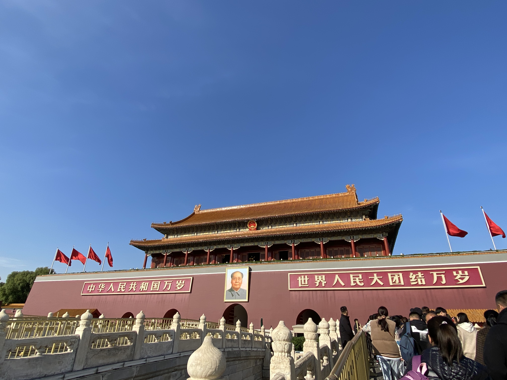</figure>
    <figure class="life-gallery-item"></figure>
    <figure class="life-gallery-item"></figure>
    <figure class="life-gallery-item"></figure>
    <figure class="life-gallery-item"></figure>
    <figure class="life-gallery-item">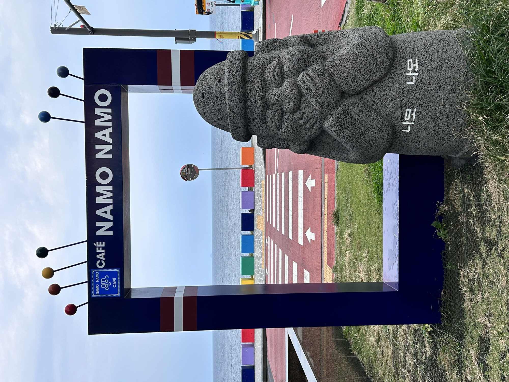</figure>
    <figure class="life-gallery-item">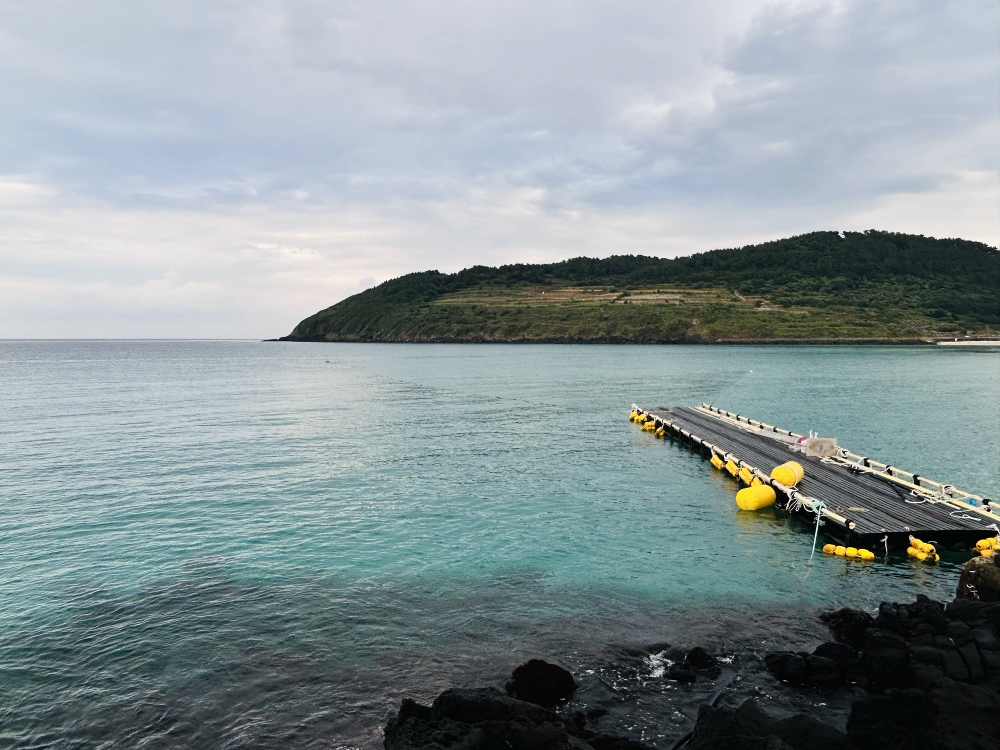</figure>
    <figure class="life-gallery-item">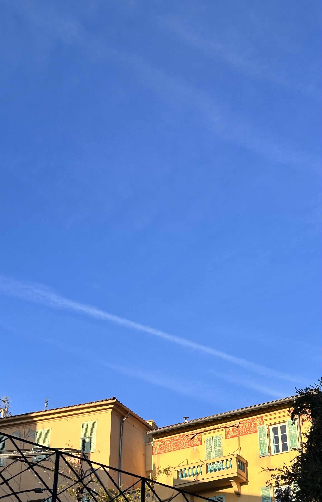</figure>
    <figure class="life-gallery-item">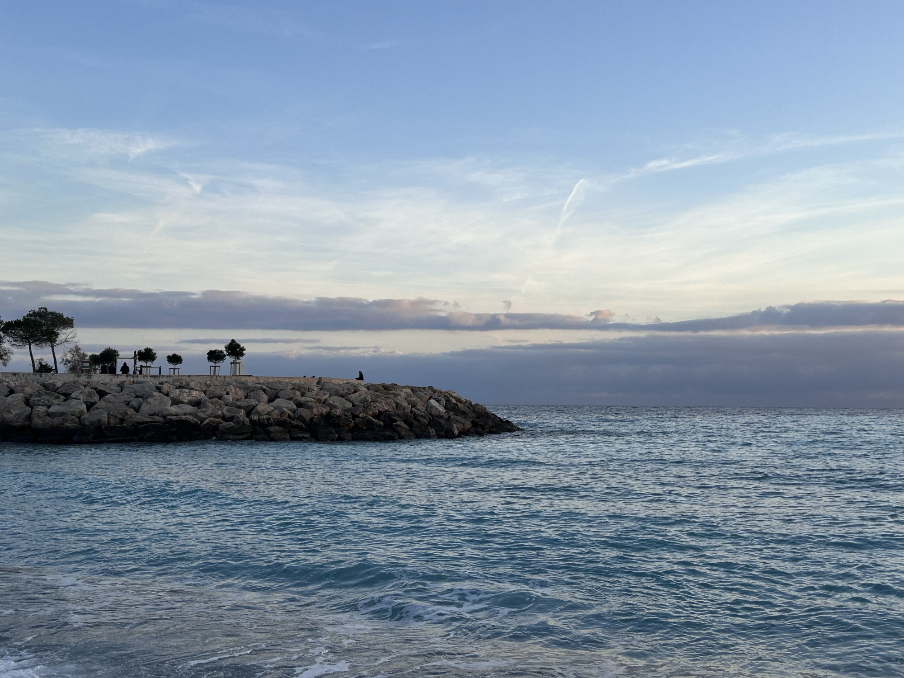</figure>
  

