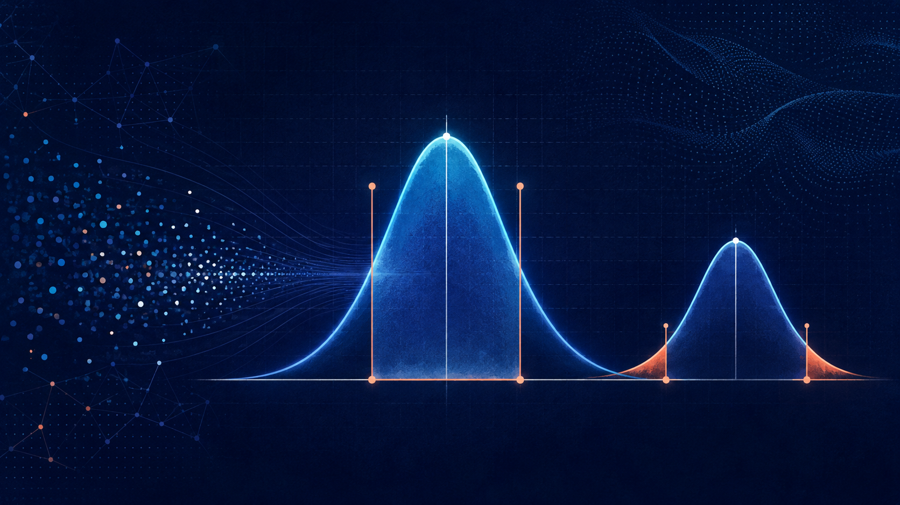

## Course overview

This course introduces probability theory and mathematical statistics, covering events, conditional probability, independence, random variables and joint distributions, expectation and variance, and limit theorems. Building on these foundations, it develops statistical inference through sampling distributions, point and interval estimation, large-sample theory, bootstrap methods, and hypothesis testing, including p-values, likelihood-ratio tests, and goodness-of-fit tests.

{.course-overview-image fig-alt="Statistical illustration showing density curves, confidence-interval markers, sample points, and highlighted p-value tails"}

## Course materials

*Course materials will be continuously updated throughout the course.*

### Syllabus

[Download the syllabus (PDF)](course-materials/stat2002/STAT2002-syllabus.pdf){.btn .btn-outline-primary download="STAT2002-syllabus.pdf"}

### Lecture 1: Events and Their Probabilities (1)

::: lecture-downloads
[Download the slides (PDF)](course-materials/stat2002/STAT2002-1-events-and-probability.pdf){.btn .btn-outline-primary .slides-download download="STAT2002-1-events-and-probability.pdf"}
:::

## Course schedule

2026 Fall · Fridays 09:45–12:10 · Room 3A111

<table>
<thead>
<tr><th scope="col">Week</th><th scope="col">Date</th><th scope="col">Planned topics</th><th scope="col">Textbook / sections</th><th scope="col">Assignment</th></tr>
</thead>
<tbody>
<tr><td>1</td><td>Sep 4</td><td>A brief history of probability; random experiments, sample spaces, and events; definition and properties of probability</td><td>1.1–1.3</td><td></td></tr>
<tr><td>2</td><td>Sep 11</td><td>Conditional probability; the law of total probability; Bayes' formula; independence</td><td>1.4–1.5</td><td></td></tr>
<tr><td>3</td><td>Sep 18</td><td>Random variables; discrete random variables and their distributions</td><td>2.1–2.2</td><td></td></tr>
<tr><td>4</td><td>Sep 20 <small>Sunday; rescheduled from Sep 25</small></td><td>Continuous random variables and their distributions; distributions of functions of random variables</td><td>2.3–2.4</td><td></td></tr>
<tr><td>5</td><td>Oct 2</td><td>No class — National Day holiday</td><td></td><td></td></tr>
<tr><td>6</td><td>Oct 9</td><td>Random vectors; marginal and conditional distributions; mutual independence; distributions of functions of random vectors</td><td>3.1–3.5</td><td></td></tr>
<tr><td>7</td><td>Oct 16</td><td>Expectation, median, variance, moments, and entropy; the law of large numbers and the central limit theorem</td><td>4.1–4.4</td><td></td></tr>
<tr><td>8</td><td>Oct 23</td><td>A brief history of statistics; basic concepts; populations, samples, and sampling distributions</td><td>5.1–5.3</td><td></td></tr>
<tr><td>9</td><td>Oct 30</td><td>Point estimation; the method of moments and maximum likelihood estimation</td><td>6.1–6.3</td><td></td></tr>
<tr><td>10</td><td>Nov 6</td><td>Criteria for evaluating estimators; large-sample theory of point estimation</td><td>6.4–6.5</td><td></td></tr>
<tr><td>11</td><td>Nov 13</td><td>Interval estimation; the pivotal quantity method</td><td>7.1–7.2</td><td></td></tr>
<tr><td>12</td><td>Nov 20</td><td>Large-sample methods; bootstrap confidence intervals; confidence limits</td><td>7.3–7.5</td><td></td></tr>
<tr><td>13</td><td>Nov 27</td><td>Hypothesis testing; tests for the mean and variance of a single normal population</td><td>8.1; 8.2.1</td><td></td></tr>
<tr><td>14</td><td>Dec 4</td><td>Comparing means and variances of two normal populations; paired-sample tests for means</td><td>8.2.2–8.2.3</td><td></td></tr>
<tr><td>15</td><td>Dec 11</td><td>Tests for a proportion; likelihood ratio tests</td><td>8.3–8.4</td><td></td></tr>
<tr><td>16</td><td>Dec 18</td><td>p-values; goodness-of-fit tests</td><td>8.5; 9.1</td><td></td></tr>
<tr><td>17</td><td>Dec 25</td><td>Course review</td><td>1–9</td><td></td></tr>
<tr><td>18</td><td>Jan 1, 2027</td><td>No class — New Year's Day holiday</td><td></td><td></td></tr>
</tbody>
</table>

